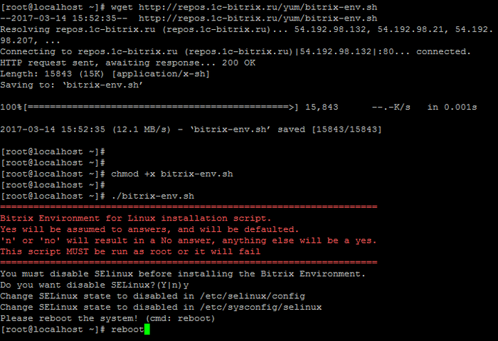
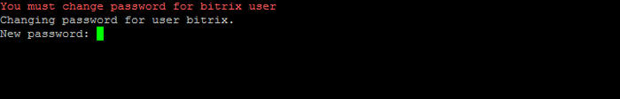
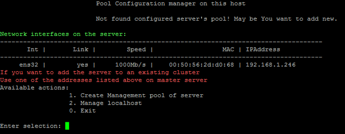

# Bitrix Vm

> «1C-Битрикс: Виртуальная машина» - бесплатный программный продукт, готовый к немедленному использованию виртуальный сервер, полностью настроенный, протестированный и адаптированный для оптимальной работы как с продуктами «1С-Битрикс», так и с любыми PHP-приложениями.

Виртуальная машина сэкономит время и силы на правильное развертывание и администрирование сайта или внутреннего информационного ресурса на базе продуктов «1С-Битрикс».
С помощью специальных ВМ-решений вы можете быстро получить оптимально сконфигурированный сервер, не уступающий по производительности VMBitrix, а по масштабируемости - превосходящий виртуальную машину «1С-Битрикс». Пакеты подготовлены специалистами «1С-Битрикс» и доступны для скачивания и использования.

«1С-Битрикс: Веб-окружение» - Linux позволяет быстро и с минимальными затратами развернуть оптимальное окружение для работы продуктов и решений «1С-Битрикс» на Linux-платформе **CentOS 7 (x86_64)**:
- mysql-server 5.*
- web-server (Apache 2.4.*)
- php 7.х, 8.x
- nginx 1.20
- memcached
- stunnel
- catdoc
- xpdf
- munin
- nagios
- sphinx

## Установка на CentOS 7
Рассмотрим установку «1С-Битрикс: Веб-окружение» - Linux на оборудовании с уже установленной **CentOS 7 (Minimal) (x86_64)**.

1. Авторизуемся на сервер под административным аккаунтом **root** и обновляем все пакеты системы:
    > `yum clean all && yum update`

2. Загружаем скрипт «1С-Битрикс: Веб-окружение» - Linux и запускаем его командами:
   > `wget https://repo.bitrix.info/yum/bitrix-env.sh && chmod +x bitrix-env.sh && ./bitrix-env.sh`

> **Примечание:** Если на сервере нет утилиты для загрузки файлов **wget**, то ее можно установить командой `yum install wget`

3. Далее необходимо согласиться на отключение **SELinux** (если SELinux включен в системе) и перезагрузить машину командой `reboot`:
   

4. После перезагрузки сервера снова продолжите установку BitrixEnv:

> `./bitrix-env.sh`

5. При первом входе на сервер с логином **root** будет предложено сменить пароль у пользователя **bitrix**:

6. Далее нужно создать пул (1. Create Management pool of server) и можно приступать к работе:

> **Внимание!** В VMBitrix **версии 7.x+** нужно обязательно создать пул (1. Create Management pool of server). Мастер создания пула откроет все необходимые порты в CentOS для корректной работы сервисов продуктов «1С-Битрикс»:
> - 22 – ssh доступ;
> - 80 / 443 – http / https web-сервер;
> - 8890 / 8891 – http/https ntlm;
> - 8893 / 8894 – http/https сервер мгновенных сообщений;
> - 5222 / 5223 – http/https xmpp-сервер.
> 
> Если пул не создан, то открыты только 22, 80 и 443 порты.
> Внутри машины могут использоваться дополнительные порты для служб и сервисов, но они не открываются наружу.

7. Cервер готов для дальнейшего использования.
8. После всех настроек сервера в целях безопасности не забудьте выйти из учетной записи **root**:
   - Выйти в консоль, выбрав в меню **0. Exit** (или нажать **Ctrl+C**)
   - И затем в консоли выполнить команду ``exit``