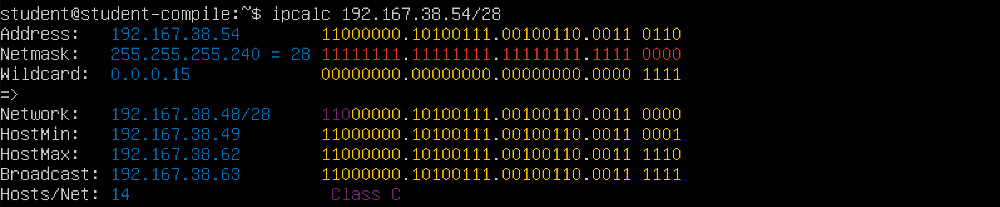
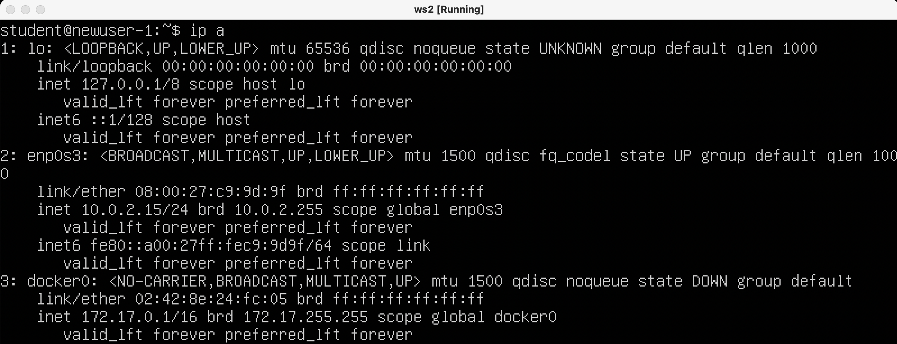
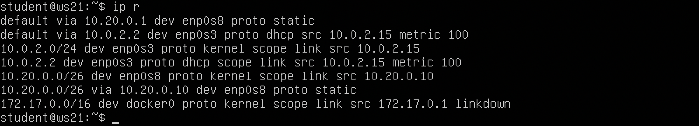
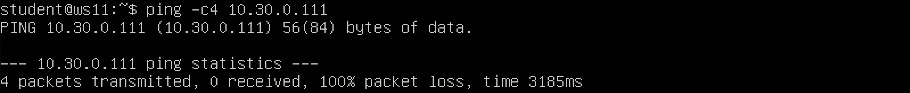
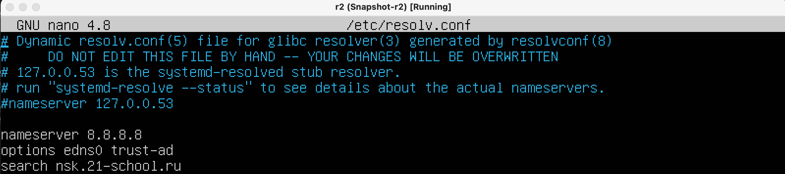

# Сети в Linux  
Настройка сетей в Linux на виртуальных машинах.

## Part 1. Инструмент ipcalc
### 1. Установим ipcalc:  
`sudo apt install ipcalc`
### 2. Сети и маски  
- Определяем адрес сети: 192.167.38.54/13  

Адрес сети - 192.160.0.0  
- Перевод масок:  
    - обычная запись: 255.255.255.0  
префиксная: /24   
двоичная запись: 11111111.11111111.11111111.00000000  

    - префиксная запись: /15  
обычная запись: 255.254.0.0  
двоичная запись: 11111111.11111110.00000000.00000000  

    - двоичная запись: 11111111.11111111.11111111.11110000  
обычная запись: 255.255.255.240  
префиксная запись: /28  
  
- Минимальный и максимальный хост в сети 12.167.38.4 при масках:
    - /8  
HostMin: 12.0.0.1  
HostMax: 12.255.255.254  

    - 11111111.11111111.00000000.00000000  
HostMin: 12.167.0.1  
HostMax: 12.167.255.254

    - 255.255.254.0  
HostMin: 12.167.38.1  
HostMax: 12.167.39.254

    - /4  
HostMin: 0.0.0.1  
HostMax: 15.255.255.254

### 3. `Localhost`  — в компьютерных сетях, стандартное, официально зарезервированное, доменное имя для частных IP-адресов (в диапазоне 127.0.0.1 — 127.255.255.255, RFC 2606), то есть для сети, состоящей только из одного компьютера.  
- Проверяем, можно ли обратиться к приложению, работающему на localhost, со следующими IP: 

 194.34.23.100 -> нельзя  
 127.0.0.2 -> можно  
 127.1.0.1 -> можно  
 128.0.0.1 -> нельзя  
### 4. Диапазоны и сегменты сетей
 - Диапазоны для локальных сетей (все остальные относятся к публичным):  
Класс A - `10.0.0.0 — 10.255.255.255`  
Класс B - `172.16.0.0 — 172.31.255.255`  
Класс C - `192.168.0.0 — 192.168.255.255`  
 - Какие из перечисленных IP можно использовать в качестве публичного, а какие только в качестве частных:   
 10.0.0.45 -> частный  
 134.43.0.2  -> публичный  
 192.168.4.2 -> частный  
 172.20.250.4 -> частный  
 172.0.2.1 -> публичный  
 192.172.0.1 -> публичный  
 172.68.0.2 -> публичный  
 172.16.255.255 -> частный  
 10.10.10.10 -> частный  
 192.169.168.1 -> публичный
- Какие из перечисленных IP адресов шлюза возможны у сети 10.10.0.0/18.  
    - Для сети 10.10.0.0/18 диапазон возможных адресов  
    `10.10.0.1 - 10.10.63.254`

    - Возможные IP адреса: 10.10.0.2, 10.10.10.10, 10.10.1.255
    - Недопустимые IP адреса: 10.0.0.1, 10.10.100.1 
## Part 2. Статическая маршрутизация между двумя машинами
### 1. Поднять две виртуальные машины (далее -- ws1 и ws2)  
  

С помощью команды `ip a` смотрим существующие сетевые интерфейсы:
- для машины **ws1**  
  
- для машины **ws2**  
  

Задаём адреса и маски для каждой машины:  
- Конфигурация netplan описывается языком YAML(язык для хранения информации в формате понятном человеку). Опишем ее детально:
    - network – слово-маркер, обозначающее старт логического блока сети;
    - ethernets – вид сетевого интерфейса, показывает, что дальше настраивается Ethernet-сеть;
    - enp0s3 – имя интерфейса, который надлежит сконфигурировать;
    - addresses – список IP-адресов, относящихся к интерфейсу;
    - dhcp4 - получение IPv4 адреса по DHCP, которое в данном случае необходимо отключить;
    - version – версия языка YAML
- для **ws1**: 192.168.100.10/16 и выполняем команду `netplan apply` для перезапуска сервиса сети:  

- для **ws2**: 172.24.116.8/12 и выполняем команду `netplan apply` для перезапуска сервиса сети:  

- проверяем сетевые интерфейсы для **ws1**  

- проверяем сетевые интерфейсы для **ws2**  

### 2. Добавление статического маршрута вручную  
Добавить статический маршрут от одной машины до другой и обратно можно при помощи команды:  
`ip r add [address we want to connect to] dev [network name]`   
- Добавим статический маршрут от **ws1** до **ws2** и пропингуем соединение:  
  
- Проделаем тоже самое для второй машины:  
  
### 3. Добавление статического маршрута с сохранением  
- Перезапускаем машины при помощи команды `reboot`  
- Добавляем статический маршрут от **ws1** до **ws2** с помощью файла etc/netplan/00-installer-config.yaml и перезапускаем сервисы сети через команду `sudo netplan apply`:  
  
- Добавляем статический маршрут от **ws2** до **ws1** с помощью файла etc/netplan/00-installer-config.yaml и перезапускаем сервисы сети через команду `sudo netplan apply`:  
  
- Пропингуем соединение между машинами:
    - от **ws1** до **ws2**  
    
    - от **ws2** до **ws1**  
    
## Part 3. Утилита iperf3
### 1. Перевести и записать в отчёт:  
- 8 Mbps = 1 MB/s
- 100 MB/s = 800000 Kbps 
- 1 Gbps =  1000 Mbps
### 2. Утилита iperf3  
- Устанавливаем утилиты **iperf3** на обе машины с помощью команды `sudo apt install iperf3`  
- Измерение скорость соединения между **ws1** и **ws2**:  
    - делаем машину **ws1** сервером:  
    `iperf3 -s`  
     
    - далее на машине **ws2** измеряем скорость соединения через команду:  
    `iperf3 -c 172.24.116.8 -f K`  
    
    - вывод с машины **ws1**:
    

## Part 4. Сетевой экран
### 1. Утилита iptables  
- Устанавливаем утилиты **iperf3** на обе машины с помощью команды `sudo apt install iptables`  
- Создаём файл **/etc/firewall.sh**, имитирующий фаерволл, на **ws1** и **ws2**:  

- Добавляем в файл подряд следующие правила:
    1. На ws1 применить стратегию когда в начале пишется запрещающее правило, а в конце пишется разрешающее правило (это касается пунктов 4 и 5)
    2. На ws2 применить стратегию когда в начале пишется разрешающее правило, а в конце пишется запрещающее правило (это касается пунктов 4 и 5)
    3. Открыть на машинах доступ для порта 22 (ssh) и порта 80 (http)
    4. Запретить echo reply (машина не должна "пинговаться”, т.е. должна быть блокировка на OUTPUT)
    5. Разрешить echo reply (машина должна "пинговаться")  
Файл **/etc/firewall.sh** на **ws1**:

Файл **/etc/firewall.sh** на **ws2**:  

- Запустим файлы на обеих машинах командами `sudo chmod +x /etc/firewall.sh` и `sudo /etc/firewall.sh`  
    - Запуск на **ws1**:
    
    - Запуск на **ws2**:  
      
Разница в стратегиях:  
утилита **iptables** выполняет прописанные правила подряд сверху вниз по порядку, поэтому на машине **ws1** пинг не случится, так как первой стоит команда **REJECT**, которая отклонит пакет подключения. Во втором случае, на машине  **ws2** пинг пройдёт, так как сначала стоит команда **ACCEPT**, разрешающая прохождения пакета подключения.
## 4.2. Утилита nmap
### 1. Командой `ping` найдём машину, которая не "пингуется":  
- пингуем **ws2** c машины **ws1** -> машины пингуются:

- пингуем **ws1** c машины **ws2** -> машины не пингуются:  
  
### 2. Утилитой `nmap` показать, что хост машины запущен:  
  
Строка 'Host is up' говорит о том, что хост машины запущен
### 3. Сохраняем дампы образов виртуальных машин:  

## Part 5. Статическая маршрутизация сети
Поднимаем пять виртуальных машин (3 рабочие станции (ws11, ws21, ws22) и 2 роутера (r1, r2))

### 1. Настройка адресов машин  
Настроить конфигурации машин в etc/netplan/00-installer-config.yaml согласно сети на рисунке:  

- содержание файла `etc/netplan/00-installer-config.yaml` для машины **ws11**:  

- содержание файла `etc/netplan/00-installer-config.yaml` для машины **r1**:  

- содержание файла `etc/netplan/00-installer-config.yaml` для машины **r2**:  
 [Title](LinuxNetwork_report.md)
- содержание файла `etc/netplan/00-installer-config.yaml` для машины **ws21**:  

- содержание файла `etc/netplan/00-installer-config.yaml` для машины **ws22**:    
  

Перезапустим сервис сети и командой `ip -4 a` проверим, что адрес машины задан верно:
- машина **ws11**:  

- машина **r1**:  

- машина **r2**:  

- машина **ws21**:  

- машина **ws22**:  
  

Пропингуем  **ws22** с **ws21**:  

Аналогично пропингуем **r1** с **ws11**:

### 2. Включение переадресации IP-адресов
Для включения переадресации IP, выполните команду на роутерах `sysctl -w net.ipv4.ip_forward=1`  
- роутер **r1**:  

- роутер **r**:  

Далее откроем файл `/etc/sysctl.conf` и добавьте в него следующую строку: **net.ipv4.ip_forward = 1** 
- роутер **r1**:  

- роутер **r2**:  
  
### 3. Установка маршрута по-умолчанию
Настроим маршрут по-умолчанию (шлюз) для рабочих станций  
Для этого добавить **default** перед IP роутера в файле конфигураций
- машина **ws11**:  
  
- машина **ws21**:  

- машина **ws22**:  

Вызваем `ip r`, чтобы показать, что добавился маршрут в таблицу маршрутизации:  
- машина **ws11**:  

- машина **ws21**:  

- машина **ws22**:  
  

Пропингуем с машины **ws11** роутер **r2**:  
  
Для того, чтобы проверить, что пинг проходит используем команду: `sudo tcpdump -tn -i enp0s9 -c4`  
  
### 4. Добавление статических маршрутов
Добавим в роутеры r1 и r2 статические маршруты в файле конфигураций:
- роутер **r1**:  

- роутер **r1**:  
  

Вызываем `ip r`, чтобы показать таблицы с маршрутами на обоих роутерах:
- роутер **r1**:  

- роутер **r1**:  

Запустим команды на ws11: `ip r list 10.10.0.0/[маска сети]` и `ip r list 0.0.0.0/0`:  
  
Для адреса 10.10.0.0/18 был выбран маршрут, отличный от 0.0.0.0/0, хотя он попадает под маршрут по-умолчанию, потому что роутер считает маршруты с наибольшей маской более приоритетными, таким образом маршрут с маской /0 - самый последний по приоритету

### 5. Построение списка маршрутизаторов
Запустим на **r1** команду дампа: `tcpdump -tnv -i enp0s9`  
  
При помощи команды `sudo traceroute 10.20.0.10` построим список маршрутизаторов на пути от **ws11** до **ws21**:  
  
Для определения промежуточных маршрутизаторов **traceroute** отправляет целевому узлу серию ICMP-пакетов (по умолчанию 3 пакета), с каждым шагом увеличивая значение поля TTL («время жизни») на 1. Первая серия пакетов отправляется с TTL, равным 1, и поэтому первый же маршрутизатор возвращает обратно ICMP-сообщение «time exceeded in transit», указывающее на невозможность доставки данных. Traceroute фиксирует адрес маршрутизатора, а также время между отправкой пакета и получением ответа (эти сведения выводятся на монитор компьютера). Затем traceroute повторяет отправку серии пакетов, но уже с TTL, равным 2, что заставляет первый маршрутизатор уменьшить TTL пакетов на единицу и направить их ко второму маршрутизатору. Второй маршрутизатор, получив пакеты с TTL=1, так же возвращает «time exceeded in transit»  
### 6. Использование протокола ICMP при маршрутизации
Запустить на **r1** перехват сетевого трафика, проходящего через eth0 с помощью команды: `sudo tcpdump -n -i eth0s8 icmp`  
  
Пропингуем с **ws11** несуществующий IP (например, 10.30.0.111) с помощью команды: `ping -c4 10.30.0.111`  
  
Сохраним дампы образов виртуальных машин:  
  
## Part 6. Динамическая настройка IP с помощью DHCP
Для **r2** настроим в файле /etc/dhcp/dhcpd.conf конфигурацию службы DHCP: 
- установим нужные нам утилиты, чтобы получить файл **dhcpd.conf**: `sudo apt install isc-dhcp-server` и `sudo apt install resolvconf`
- указываем адрес маршрутизатора по-умолчанию, DNS-сервер и адрес внутренней сети в файле /etc/dhcp/dhcpd.conf:  
  
- в файле resolv.conf прописать `nameserver 8.8.8.8`
  
- перезагрузим службу DHCP командой `sudo systemctl restart isc-dhcp-server`  

- машину **ws21** перезагрузим при помощи `reboot` и через `ip a` покажем, что она получила адрес:  

- пропингуем **ws22** с **ws21**:  
  

Укажем MAC адрес у **ws11**, для этого в etc/netplan/00-installer-config.yaml добавим строки: `macaddress: 10:10:10:10:10:BA` и `dhcp4: true`:  
  
Для **r1** аналогично настроим **r2**, но сделаем выдачу адресов с жесткой привязкой к MAC-адресу (ws11):  
- установим DHCP на **r1** командой `sudo apt install isc-dhcp-server`
- отредактируем файл /etc/dhcp/dhcpd.conf на **r1**:  

- отредактируем файл resolv.conf на **r1**:  

- перезагрузим службу DHCP командой `sudo systemctl restart isc-dhcp-server`  

- перезагрузим **ws11** при помощи `reboot` и через `ip a` покажем, что она получила адрес:  

- в настройках машины **ws11** пропишем MAC Address:  

- проведём аналогичные тесты:  
  

Запросим с **ws21** обновление ip адреса:
- IP до обновления:  

- удаляем старые адреса `sudo dhclient -r` и получаем новые `sudo dhclient`  
  
- Опции **DHCP**, которые мы используем:
    - **subnet** – сеть, в которой будут работать настройки;
    - **netmask** - маска подсети;
    - **range** – диапазон IP-адресов;
    - **option routers** – шлюз по-умолчанию;
    - **option domain-name-servers** – DNS-сервера;
    - **host** - привязка к MAC-адресу

Сохраним дампы образов виртуальных машин:  

## Part 7. NAT
В файле /etc/apache2/ports.conf на  и **r1** изменим строку `Listen 80` на `Listen 0.0.0.0:80`, то есть сделаем сервер Apache2 общедоступным:  
- роутер **r1**  

- машина **ws22**  

Запустим веб-сервер Apache командой `service apache2 start` на **ws22** и **r1**:
- машина **ws22** 

- роутер **r1**  
  

Добавляем в фаервол, созданный по аналогии с фаерволом из Части 4, на **r2** следующие правила:
1) Удаление правил в таблице `filter - iptables -F`
2) Удаление правил в таблице "NAT" - `iptables -F -t nat`
3) Отбрасывать все маршрутизируемые пакеты - `iptables --policy FORWARD DROP`  

  
Запускаем и проверяем:  

Проверить соединение между **ws22** и **r1** командой `ping`. При запуске файла с этими правилами, **ws22** не должна "пинговаться" с **r1**:  
  
Добавить в файл ещё одно правило:  

4. разрешить маршрутизацию всех пакетов протокола ICMP: 

Запустим и проверим:  
  
Проверить соединение между **ws22** и **r1** командой `ping`. При запуске файла с этими правилами, **ws22** должна "пинговаться" с **r1**:

Добавим в файл ещё два правила:  

5. Включить **SNAT**, а именно маскирование всех локальных ip из локальной сети, находящейся за **r2** (по обозначениям из Части 5 - сеть 10.20.0.0)

6. Включить **DNAT** на 8080 порт машины **r2** и добавить к веб-серверу Apache, запущенному на **ws22**, доступ извне сети  
  

И запустим систему:

Отключаем сетевой интерфейс **NAT** (проверяем командой `ip a`) в VirtualBox 

На скриншоте видно, что адаптера **enp0s8**, который отвечал за интернет, нет  

Проверяем соединение по TCP для SNAT, для этого с **ws22** подключиться к серверу Apache на **r1** командой:
`telnet [адрес] [порт]`

Проверить соединение по TCP для DNAT, для этого с **r1** подключиться к серверу Apache на **ws22** командой `telnet` (обращаться по адресу **r2** и порту 8080)

## Part 8. Дополнительно. Знакомство с SSH Tunnels  
Запустим на **r2** фаервол с правилами из Части 7:  
  
Воспользуемся Local TCP forwarding с **ws21** до **ws22**, чтобы получить доступ к веб-серверу на **ws22** с **ws21** `sudo ssh -L 8080:localhost:80 student@10.20.0.20`:  
  
Воспользуемся Remote TCP forwarding c **ws11** до **ws22**, чтобы получить доступ к веб-серверу на **ws22** с **ws11** `sudo ssh -R 8080:localhost:80 student@10.20.0.20`:  
  
Для проверки, сработало ли подключение в обоих предыдущих пунктах, перейдите во второй терминал (например, клавишами fn + option + F2) и выполните команду:
`telnet 127.0.0.1 [локальный порт]`  
